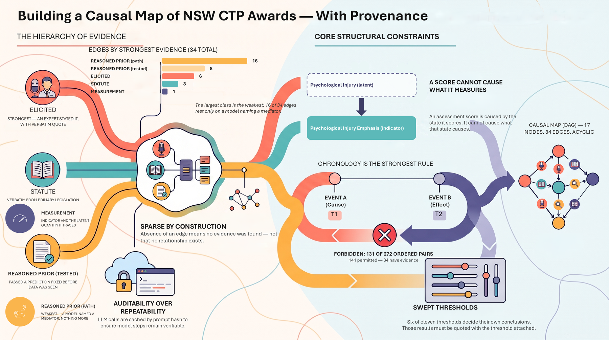

# causal-map-nsw-ctp

A pipeline that builds a causal DAG for NSW Compulsory Third Party impairment lump-sum
awards **from evidence with provenance**, and records what it could not establish.

Every edge in the output traces to something checkable: a provision quoted verbatim from
the Act, a reasoned prior that survived a prediction registered before the data was
consulted, or a domain expert's stated claim. Edges without evidence are not drawn.



> ### ⚠ Read this before using the graph
>
> **No practitioner has reviewed it.** The statutory edges quote primary legislation, but
> the reading of those provisions was done by a language model, and most edges rest on
> model reasoning that was tested rather than verified. Treat the output as a structured,
> auditable set of hypotheses for domain review — not as a description of how NSW CTP
> awards are determined.
>
> The project began as a hand-authored 49-edge graph that turned out to be
> LLM-generated and mislabelled "expert-elicited". Rebuilding it with provenance is the
> point of everything here.

---

## What it produces

| Artefact | |
|---|---|
| [`causal/ctp_reviewed_dag.html`](causal/ctp_reviewed_dag.html) | Self-contained interactive graph, with an effect estimate on 33 of 34 edges — green/red by sign, solid/dashed by whether the 95% interval excludes zero. Click an edge for its provision quote, tested mechanism, backdoor set and estimate. |
| [`causal/provenance/banded_graph.json`](causal/provenance/banded_graph.json) | The assembled graph: edges, evidence per edge, roles, violations, cycle breaks. |
| [`ctp/dictionary.md`](ctp/dictionary.md) | Data dictionary, generated from [`ctp/columns.yaml`](ctp/columns.yaml). |
| [`docs/ordinals-review.md`](docs/ordinals-review.md) | The eight ordinal columns: level distributions, what separates the levels, and how each is used downstream. |
| [`causal/ctp_identification_contrast.html`](causal/ctp_identification_contrast.html) | The competing analysis: what changes when the adjustment set changes. Two treatments change sign. |
| [`docs/LLM-elicited-vs-TabPFN-causal.md`](docs/LLM-elicited-vs-TabPFN-causal.md) | **The two approaches compared.** Changing only the adjustment set flips two treatments' sign. |
| [`docs/project-infographic.svg`](docs/project-infographic.svg) | The same summary, generated from the artefacts by `stage16`. The illustrated PNG above is drawn by hand and can drift; this one cannot, so it is what the PNG is checked against. |
| `causal/provenance/*.json` | Every intermediate result, including the LLM request/response cache. |

Current state: **17 nodes** (1 latent), **34 edges** with an effect estimate on 33 of them,
acyclic, against 141 chronologically permitted pairs. Sparse by construction — absence of an edge means no evidence was found,
not that no relationship exists.

[](causal/ctp_reviewed_dag.html)

Chronology runs left to right and no edge may run backwards. Green is a positive effect, red
negative; solid means the 95% interval excludes zero, dashed means it does not, grey means no
estimate — which is a different claim from an estimate of zero. The dashed box is the one
latent node. Open
[`causal/ctp_reviewed_dag.html`](causal/ctp_reviewed_dag.html) to click any edge for its
provision quote, tested mechanism, backdoor set and estimate.

---

## Evidence classes, strongest first

| Class | What it means | Evidence items | Edges where it is the strongest |
|---|---|---|---|
| `elicited` | A domain expert stated it, with mechanism and verbatim quote. [`causal/elicited_edges.yaml`](causal/elicited_edges.yaml) | 6 | 6 |
| `statute` | A provision names the input, quoted verbatim from primary source, and cases citing it differ on the variable | 5 | 3 |
| `measurement` | An indicator and the latent quantity it traces | 1 | 1 |
| `reasoned_prior_tested` | Blind causal reasoning that passed a prediction fixed before the data was seen | 10 | 8 |
| `reasoned_prior_path` | An `indirect` verdict naming a mediator. **Weakest — and the item count overstates support**, since one edge appearing as a leg in several paths is counted once per path | 23 | 16 |

**34 edges carry 45 evidence items.** The right-hand column is the one to read: an edge with
both a statute quote and a reasoned prior rests on the statute, and is counted there only.
Both columns are computed in [`causal/provenance/banded_graph.json`](causal/provenance/banded_graph.json)
(`edges_by_strongest_class`), not typed in here.

---

## The pipeline

Each stage writes a JSON artefact and is independently re-runnable. LLM calls are cached
by prompt hash and the cache is committed, so the model steps are auditable rather than
merely repeatable in principle.

| Stage | | API |
|---|---|---|
| `stage0_measurement_ledger` | How each column was produced: 8 read off decisions, 8 scored by a model | |
| `stage1_associations` | All 120 pairs — marginal, partial, signed tail dependence, materiality | |
| `stage2_temporal` | Chronology from dated event logs, with the event→variable mapping *derived*, not asserted | |
| `stage3a_provision_links` | Which variables cases differ on when a provision is cited | |
| `stage3b_fetch_statute` | Provision text from locally saved primary source, identified by content | |
| `stage3c_read_provisions` | Blind reading of each provision + adversarial challenge | ✓ |
| `stage3d_statutory_edges` | Join the statutory and empirical legs | |
| `stage5a/b_priors` | Blind causal priors with pre-registered, executable predictions | ✓ |
| `stage6_sensitivity` | Sweep every threshold; report which ones decide the answer | |
| `stage8_variable_roles` | Driver / pass-through / recorder from unique contribution to the target | |
| `stage9_enforce_bands` | Chronology enforced, evidence assembled, cycles broken | |
| `stage10_derive_bands` | Chronology *derived* blind, as a check on the asserted one | ✓ |
| `stage11_render_dag` | The reviewable page | |
| `stage12_derive_rubric` | Recover the ordinal coding rubric from the codings themselves | ✓ |
| `stage13_tabpfn_dml` | Competing analysis: DoubleML + TabPFN-3, naive vs DAG adjustment | |
| `stage14_render_dml_map` | The identification contrast: naive vs DAG adjustment | |
| `stage15_dag_effects` | Minimal backdoor sets, identifiability refusals, an effect on every edge | |
| `stage11b_export_dag_svg` | Export the graph as a standalone SVG for Markdown embedding | |
| `stage16_render_infographic` | The summary infographic, with every figure read from the artefacts | |

Plus `check_calibration.py`, which validates the statutory reader against
[provisions whose correct reading is known](causal/calibration_provisions.yaml) — including
negative cases where a correct reader must find nothing. **Run it after any prompt change.**

```bash
python -m pip install -r requirements.txt
python causal/stage0_measurement_ledger.py
python causal/stage1_associations.py
# ... stages are ordered; 3c, 5a, 7a and 10 need OPENAI_API_KEY in .env
python causal/check_calibration.py
python causal/stage11_render_dag.py
```

---

## Design decisions worth knowing

**Two structural rules need no evidence.** Chronology — an effect cannot precede its cause.
And measurement semantics — a score cannot cause what the state it scores causes, so `WPI %`
may only reach `Non-Economic Loss`, where s 4.11 makes the recorded number itself operative.
Both are declared in [`ctp/columns.yaml`](ctp/columns.yaml) and enforced in stage 9.

**Chronology is the strongest constraint.** Six bands from pre-accident to award; no edge
may run backwards. That forbids 131 of 272 ordered pairs and does more orientation work
than every statistical signal combined. It caught a reasoned prior asserting
`WPI % → Injury Burden Intensity` at 100% sample agreement — backwards, since injury
burden is a fact of the crash and WPI is a later assessment of it.

**Definitions are separated from placement.** [`ctp/columns.yaml`](ctp/columns.yaml) says
what each column measures and nothing else. Deriving the chronology from those definitions
alone reproduces the asserted bands at ρ ≈ 0.91–0.95 — an independent check, since the
model never sees the band table.

**A latent node is carried for psychological injury.** `Psychological Injury Emphasis`
measures how much the damage was *discussed*; the injury itself arose at the accident.
One column cannot sit in both places, so the latent quantity is separated from its
indicator, with a measurement edge between them.

**Thresholds are swept, not trusted.** `stage6_sensitivity` reports which parameters decide
their own conclusions. Six of eleven are fragile — those results must be quoted with their
threshold attached.

**Prompt instructions are ablated.** A warning telling the model that two columns came from
the same scoring pass produced `measurement_artifact` for 28 of 28 pairs; removing it
produced 0 of 28. The verdict was the instruction, not the data. Both runs are committed,
and neither is used.

---

## What is known to be unresolved

- **The statutory leg detects gates, limits and scope; it does not find everything.**
  Five links from 102 provisions read.
- **`reasoned_prior_path` is the weakest evidence class and carries 16 of 34 edges.** It
  records that a model named a mediator, nothing more.
- **Two instruments block automated retrieval** (`legislation.nsw.gov.au`, `austlii.edu.au`
  — Cloudflare, and AustLII's `robots.txt` names `ClaudeBot`). Statute is read from locally
  saved files, identified by content rather than filename.

---

## Superseded, kept as a record

The project began as a hand-authored 49-edge DAG described as "expert-elicited". It was
LLM-generated and no edge rested on anything checkable. Those files remain, each carrying a
banner, because the contrast with the current graph is the point of the work:

| | |
|---|---|
| `causal/build_ctp_causal_dag.py` | built the original 49-edge graph |
| `causal/ctp_causal_dashboard.html` | its dashboard |
| `causal/verify_claims.py` | checked the descriptive statistics quoted in its prose |
| [`docs/causal-algorithm.md`](docs/causal-algorithm.md) | how its edges were oriented |
| [`docs/dag-construction.md`](docs/dag-construction.md) | how its artefact was built |
| `causal/ctp_tabpfn_dml_map.html` | the DoubleML "causal map" that drew directions it had not established |

Nothing in the current pipeline reads any of them.

---

## Data

540 NSW Personal Injury Commission CTP decisions scraped from
[AustLII](https://www.austlii.edu.au/) and LLM-structured. No rows dropped, no imputation —
missingness is preserved because it is informative (`WPI %` 46.9%, `Claimant Weekly Income`
41.9%). The raw workbook carries per-case AustLII URLs, pinpoint statutory citations,
verbatim key paragraphs and dated event logs; the modelling table keeps 16 columns.

`papers/` and `specs/` are not committed — see the READMEs in each.
